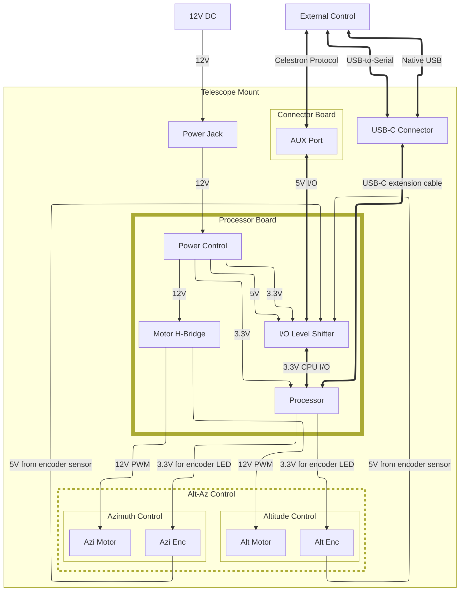

**If you don't wire up the port right, you'll fry something! Don't follow the steps below!**

# Design Notes
These are some notes relating to the design of this project.

## Purpose
The purpose of this project is to replace the mount electronics of an early Celestron Nexstar GT telescope mount. The prototype will be developed for an early (circa 2002) Celestron Nexstar 144GT mount, though other Nexstar mounts function similarly.

## Physical Dimensions
The project board will ideally fit the dimensions of Celestron MC boards, as it is intended to completely replace the MC board.

## Inputs and Outputs
Here are some of the considerations of inputs and outputs.

### Physical/Electrical Interface
The project board taps into the HC (Hand Controller) connector on the mount, which interfaces with the MC board. This is a unified communications bus inside the mount known as the Aux Bus. The HC connector is a 6P6C cable and has the following pins. See [this thread](https://www.cloudynights.com/topic/524901-nexstar-slt-controller-cabling/) and [this link](https://www.dd1us.de/Downloads/gt_inside%201_0.pdf) for details. WARNING- these haven't been verified and I unwittingly fried my MC board!
1. RTS not GND (white)
2. GND not TXD (black) (serial data from mount to HC)
3. RXD not GND (blue)
4. +12V not RXD (green) (serial data from HC to mount)
5. TXD not GND (yellow)
6. CTS not VDD (red) (+12V supply from mount)
The project board will have two 6P6C jacks. One of them will be connected to the HC connector on the mount. The HC may remain connected while the project board is connected by plugging into the other.
The VDD line of the Aux Bus will provide power to the project board.
### Protocol
The protocol for communicating between the GT HC and the GT mount is detailed [here](https://www.dd1us.de/Downloads/interconnect%20between%20handcontrollers%201_1.pdf). An additional resource is [this paper](https://www.paquettefamily.ca/nexstar/NexStar_AUX_Commands_10.pdf), though it is written from the point of view of a Nexstar GPS and not a GT.
The signaling is 4800,8,N,1 serial. The voltage levels are TTL (5V). Commands are sent without CRLF. Responses from the MC are terminated by a # character (0x23) byte.

| Hex ID  |  Description        |  Tx data      |  Rx data      |  Notes                                |  Dev notes            |
|0x01      |  Read Az Counter    |  N/A          |  24 bits      |  Signed fraction of a full rotation  |   |
|0x02      |  GoTo Fast          |  24 bits      |  ???          |  Goto position with rate = 9          |  Check the ack on this  |
|0x03      |  Reset Counter      |  N/A          |  ???          |  Set Az counter to zero              |                        |
|0x04      |  Set Counter        |  24 bits      |  ???          |  Set the Az counter to xxx            |  Not sure if this works  |
|0x05      |  Stop GoTo          |  N/A          |  ???          |  |  |
|0x06      |  Set positive guiderate  |  
