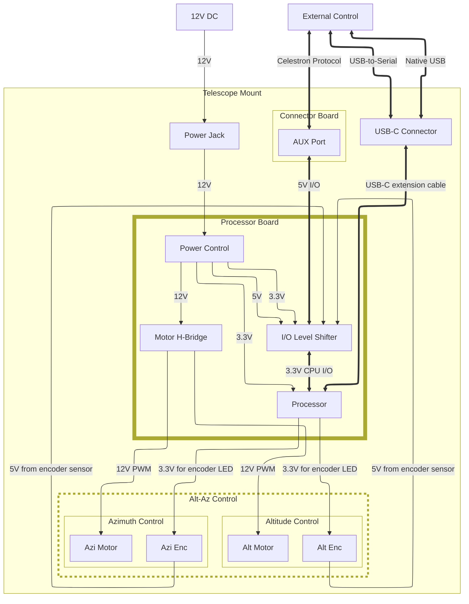

**If you don't wire up the port right, you'll fry something! Don't follow the steps below!**

# Design Notes
These are some notes relating to the design of this project.

## Purpose
The purpose of this project is to replace the mount electronics of an early Celestron Nexstar GT telescope mount. The prototype will be developed for an early (circa 2002) Celestron Nexstar 144GT mount, though other Nexstar mounts function similarly.

## Physical Dimensions
The project board will ideally fit the dimensions of Celestron MC boards, as it is intended to completely replace the MC board.

## Inputs and Outputs
Here are some of the considerations of inputs and outputs.

